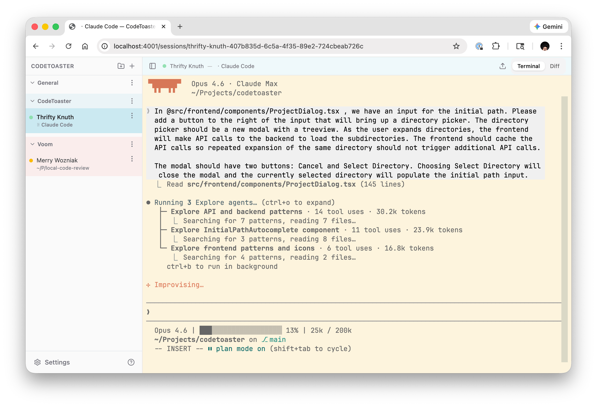
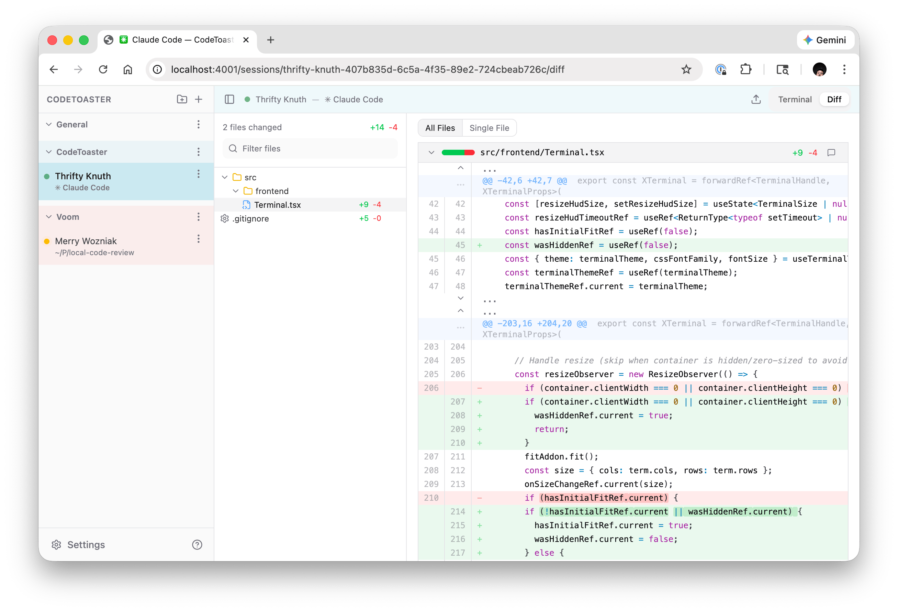

# CodeToaster

Browser-based terminal multiplexer. Multiple shell sessions managed via WebSocket, with multi-client support — multiple browsers can attach to the same session.

## Screenshots





## Features

### Sessions
- Multiple named shell sessions with sidebar navigation
- Multi-client support: share a session across browser tabs/devices
- Server-side terminal state via `@xterm/headless` — reconnect without losing output
- New sessions inherit the working directory of the current shell
- Session renaming and close confirmation with session name/title
- Live terminal preview on sidebar hover

### Projects
- Organize sessions into collapsible, color-coded projects
- Optional initial working directory per project for new sessions
- Drag-and-drop reordering of sessions and projects
- Create, rename, and delete projects
- Default "General" project for ungrouped sessions

### Terminal
- Full terminal emulation with `@xterm/xterm` and 10,000-line scrollback
- Terminal size negotiation (smallest-wins across connected clients)
- `TERM=xterm-256color` for proper color and Nerd Font support
- Clickable URLs via web links addon
- In-terminal search with match highlighting and navigation (Cmd/Ctrl+F)
- Resize HUD showing current dimensions
- Touch scrolling support for mobile

### Command Palette
- Quick access via Cmd/Ctrl+Shift+P
- Search sessions by name, title, or ID
- Fuzzy symbol search ("Find Symbol…") — jump to any definition by name
- Actions: new session, close session, rename session, toggle sidebar

### Customization
- 100+ terminal color schemes with palette preview
- 5 font families: JetBrains Mono, Fira Code, Hack, MesloLGS, Cascadia Code (all Nerd Font Mono)
- Adjustable font size (12–24px)
- App theme: system, light, or dark mode
- All preferences persisted to localStorage

### File Upload
- Drag-and-drop files onto the terminal to upload
- Paste images/files from clipboard
- Uploaded file paths are injected into the shell

### File Browser
- Built-in file browser with directory tree navigation
- View file contents with tree-sitter syntax highlighting (regex fallback)
- Markdown preview with Mermaid diagram rendering
- Cmd/Ctrl+click a symbol to jump to its definition (deep-linked, flashes on arrival)
- Line wrap toggle for long lines
- Git-based file search across the project
- Recent files tracking (5 files per session)
- Browse and view files without leaving the browser

### Notifications
- Desktop notifications via OSC 777, OSC 9, and OSC 99 (Kitty protocol)
- Browser notifications when the window is not focused
- Configurable notification sounds: chime, bell, drop, ping
- Separate bell sound control for BEL character
- Amber indicator dot for unacknowledged notifications

### Code Review
- Built-in diff viewer with unified diff parsing
- Word-level diff highlighting with tree-sitter syntax tokenization
- Cmd/Ctrl+click a symbol to view its definitions and references
- Inline and file-level comments on diff lines
- Hierarchical file tree navigation
- Single-file and all-files view modes (auto-switches for large diffs)
- Expandable context lines around hunks (persisted across tab switches)
- Rename and copy detection, including pure moves with no content changes
- Image diff support (side-by-side, added, deleted)
- Generate agent prompts from code review feedback
- Terminal/Diff/Files/Git tab switching per session

### Git
- Commit history browser over `git log --all --topo-order`, virtualized with auto-pagination
- Commit graph with colored lanes and bezier connectors
- Filterable ref sidebar (branches, remotes, tags) with a collapsible `/`-delimited folder tree
- Color-coded ref chips: HEAD solid, branch tinted, remote muted, tag amber
- Selecting a ref fetches until its SHA even when it's outside the loaded window
- Three modes per commit: metadata with clickable parents, changes (full diff viewer), and tree (browse the repo at that commit)
- Pinned "Local Changes" row linking to the working-tree diff
- Refs refresh on window focus and when terminal activity settles
- Deep-linkable via `?commit=`, `?mode=`, and `?file=` search params
- Draggable commit-list/detail split, persisted per session

### Code Intelligence
- Server-side tree-sitter syntax highlighting across ~18 languages (TypeScript/TSX, JavaScript, Python, Go, Rust, C/C++, Java, PHP, Ruby, Bash, JSON, YAML, TOML, CSS, HTML, Kotlin), shared by the file browser and diff viewer
- Automatic fallback to the client-side regex highlighter for unsupported grammars, oversized files, or any highlighting failure — highlighting never blocks the view
- Per-repository symbol index (tree-sitter tags, mtime-revalidated) for TS/JS, Python, Go, Rust, Ruby, Java, and C/C++
- Cmd/Ctrl+click any symbol to open a definitions/references popover and jump to `file:line`
- Fuzzy/prefix symbol search from the command palette

### Activity Tracking
- Animated activity indicator per session (300ms debounce)
- Color-coded status dots: active, inactive, notification pending, exited

### Keyboard Shortcuts

| Action | Mac | Windows/Linux |
|--------|-----|---------------|
| Command Palette | Cmd+Shift+P | Ctrl+Shift+P |
| Next Tab/Session (MRU) | Cmd+` | Ctrl+` |
| Previous Tab/Session (MRU) | Cmd+Shift+` | Ctrl+Shift+` |
| Search Terminal | Cmd+F | Ctrl+F |
| Find Next | Cmd+G | Ctrl+G |
| Find Previous | Shift+Cmd+G | Shift+Ctrl+G |
| Toggle Sidebar | Cmd+B | Ctrl+B |
| Prev/Next File (Diff, Git changes) | Left/Right Arrow | Left/Right Arrow |
| Go to Definition | Cmd+Click symbol | Ctrl+Click symbol |

## Tech Stack

- **Runtime:** [Bun](https://bun.sh)
- **Server:** `Bun.serve()` with WebSocket and HTML imports
- **Database:** `bun:sqlite`
- **Frontend:** React 19, TanStack Router (file-based), TanStack Query, Tailwind CSS 4, shadcn/ui
- **Terminal:** `@xterm/xterm` (client) + `@xterm/headless` (server)
- **Terminal Addons:** fit, search, serialize, web-links
- **Code Intelligence:** `web-tree-sitter` (WASM grammars) for server-side highlighting and symbol tags
- **PTY:** `Bun.spawn()` with `pty: true`
- **Styling:** `bun-plugin-tailwind`, Radix UI, Lucide icons
- **Build:** `@tanstack/router-cli` (`tsr`) for route generation

## Getting Started

```bash
bun install
```

### Development

```bash
bun run dev
```

Starts the TanStack Router watcher and Bun dev server in foreground with hot reload on port 4000.

### Production

```bash
bun run start
```

### Build standalone binary

```bash
bun run build:server
```

Produces a `codetoaster` binary in `dist-executables/`.

## CLI

CodeToaster includes a tmux-like CLI. The default command starts a background daemon; subcommands communicate with it over HTTP.

```
Usage: codetoaster [command] [options]

Commands:
  (default)       Start daemon in background
  foreground, fg  Run server in foreground (no detach)
  list, ls        List sessions
  kill <session>  Kill a session by name or ID prefix
  connections     List connected WebSocket clients
  open            Open web UI in default browser
  stop            Stop the daemon
  status          Check if daemon is running
  instances       List all running instances (across all ports)
  help            Show this help message

Options:
  --port <port>   Server port (default: 4000, or PORT env)
  --version       Show version
  --help          Show this help message
```

### Examples

```bash
# Start the daemon
codetoaster

# Check status
codetoaster status

# List sessions with CWD, client count, and age
codetoaster ls

# Kill a session by name or ID prefix
codetoaster kill my-session

# Open the web UI
codetoaster open

# List all running instances across ports
codetoaster instances

# Stop the daemon
codetoaster stop
```

The daemon stores its PID file and logs in `~/.codetoaster/`.
