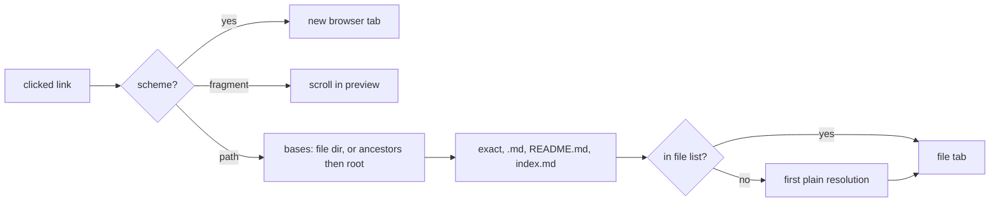

# What it renders

A markdown file tab has a Preview toggle. The preview is `react-markdown` with `remark-gfm`, so tables, task lists, strikethrough and footnotes work.[^preview] This page's frontmatter, for example, is drawn as a header above the body rather than as a raw YAML block (TASK-87).[^task-87]

- A ` ```mermaid ` fence renders as a diagram.
- The `components` passed to `react-markdown` are module-level constants. A fresh `components.pre` each render would rebuild every code block and wipe a text selection the moment ⌘ is pressed to copy it.[^preview]

# Links

Left to the browser, a relative `href` resolves against the app's own URL and lands on a route that does not exist. So the preview takes over every link that does not leave the app (TASK-122):[^task-122]

| `href` | What happens |
| --- | --- |
| `https://…`, `mailto:…` | Opens in a new browser tab |
| `#id` | Scrolls to that id inside this preview, which is how GFM footnotes and their back-references work. The app URL is left alone |
| Anything else | Resolved to a repository path and opened in a file tab |

Resolution, in `markdown-links.ts`:[^markdown-links]

1. Fragment and query are dropped (a `#L12` fragment becomes the line to open at), and percent-escapes are decoded.
2. A relative link resolves against the current file's directory.
3. A `/` link tries each ancestor of the current file, outermost first, then the repository root. A wiki in a subdirectory means its own root by `/`; GitHub means the repository's. Trying the wiki first is what keeps a wiki's `/index.md` from opening the project's README.
4. Each base tries the exact path, then `<path>.md` (extensionless wiki pages), then `README.md` and `index.md` inside it. A link ending in `/` tries only those last two.
5. The first candidate in the task's file list wins. With no hit, the plain resolution opens and the tab says the file is missing.



The file list is fetched when a link is clicked, not watched while the preview is open. Most previews are read without a click, and a watcher would refetch the whole listing on every working-tree change.

## Every form, as test data

This wiki is the fixture for that table. From this page:

- Relative: [testing](../conventions/testing.md), [terminal links](terminal-links.md), [same directory](./task-naming.md)
- Bundle-relative: [wiki maintenance](/conventions/wiki-maintenance.md), and the [index](/index.md), which must open `wiki/index.md` and not a root file
- Repository root via `/`: [the CLAUDE.md](/CLAUDE.md), and [a line in a source file](/src/frontend/utils/markdown-links.ts#L40)
- Extensionless: [the log](../log)
- Escaped: [bun shell deadlock](../gotchas/bun%2Dshell%2Ddeadlock.md)
- A directory: [the wiki root](../)
- In-page: the footnote markers on this page, and the ↩ beside each note at the bottom
- External: [the LLM Wiki pattern](https://gist.github.com/karpathy/442a6bf555914893e9891c11519de94f)

# Not yet

- Headings carry no ids, so `[x](#links)` has nothing to scroll to, and a fragment on a link to another page is dropped: the target opens at the top.
- Relative image sources still resolve against the app URL.

[^preview]: src/frontend/components/file/MarkdownPreview.tsx
[^markdown-links]: src/frontend/utils/markdown-links.ts
[^task-87]: TASK-87 — Render YAML frontmatter as a header in the markdown preview
[^task-122]: TASK-122 — Relative links in the markdown preview open the linked file
