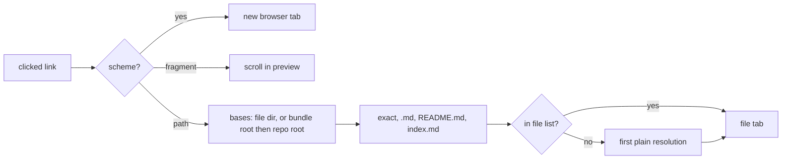

# What it renders

A markdown file tab has a Preview toggle, and so does a markdown file in a commit's File Tree: both are the same [file viewer](/modules/file-viewer.md), and everything below holds for either unless it says otherwise. The preview is `react-markdown` with `remark-gfm`, so tables, task lists, strikethrough and footnotes work.[^preview] This page's frontmatter, for example, is drawn as a header above the body rather than as a raw YAML block (TASK-87).[^task-87]

- A ` ```mermaid ` fence renders as a diagram.
- The `components` passed to `react-markdown` are module-level constants. A fresh `components.pre` each render would rebuild every code block and wipe a text selection the moment ⌘ is pressed to copy it.[^preview]

# Links

Left to the browser, a relative `href` resolves against the app's own URL and lands on a route that does not exist. So the preview takes over every link that does not leave the app (TASK-122):[^task-122]

| `href` | What happens |
| --- | --- |
| `https://…`, `mailto:…` | Opens in a new browser tab |
| `#id` | Scrolls to that heading or footnote inside this preview. The app URL is left alone |
| Anything else | Resolved to a repository path and opened in a file tab |

Resolution, in `markdown-links.ts`:[^markdown-links]

1. Fragment and query come off the path, and percent-escapes are decoded. A `#L12` fragment becomes the line to open at; any other becomes the heading to scroll to.
2. A relative link resolves against the current file's directory.
3. A `/` link tries the bundle the file sits in first, then the repository root, then any other ancestor. The bundle is the nearest ancestor holding both an `index.md` and a `log.md` — the pair an LLM wiki keeps at its root, as this one does — or, failing that, the outermost `index.md` below the repository root. A wiki in a subdirectory means its own root by `/`; GitHub means the repository's, and a file in no bundle gets GitHub's reading. Asking for the bundle by its markers keeps a wiki's `/index.md` from opening an outer page or a section's own index, and a monorepo package's `/README.md` from opening the package's.
4. Each base tries the exact path, then `<path>.md` (extensionless wiki pages), then a `README.md`, `readme.md` or `index.md` inside it. A link that says it is a directory (`docs/`, `.`, `..`) tries only the last three.
5. The first candidate in the task's file list wins. With no hit, the plain resolution opens and the tab says the file is missing. A link that climbs out of the repository opens nothing and says so.



The file list is fetched when a link is clicked, not watched while the preview is open. Most previews are read without a click, and a watcher would refetch the whole listing on every working-tree change. A cached list answers at once unless the working tree has changed since, in which case the click waits for a fresh one, so a page the agent just wrote resolves.

## Every form, as test data

This wiki is the fixture for that table. From this page:

- Relative: [testing](../conventions/testing.md), [terminal links](terminal-links.md), [same directory](./task-naming.md)
- Bundle-relative: [wiki maintenance](/conventions/wiki-maintenance.md), and the [index](/index.md), which must open `wiki/index.md` and not a root file
- Repository root via `/`: [the CLAUDE.md](/CLAUDE.md), and [a line in a source file](/src/frontend/utils/markdown-links.ts#L40)
- A line of a markdown page, which lands on the rendered block holding it: [the log's first entry](../log.md#L4)
- Extensionless: [the log](../log)
- Escaped: [bun shell deadlock](../gotchas/bun%2Dshell%2Ddeadlock.md)
- A directory: [the wiki root](../)
- In-page: [back to Links](#links), and the footnote markers on this page with the ↩ beside each note at the bottom
- Another page's heading: [no test spawns the real agent](../conventions/testing.md#no-test-spawns-the-real-agent), and the Bitbucket spelling of one, [what goes where](/conventions/testing.md#markdown-header-what-goes-where)
- External: [the LLM Wiki pattern](https://gist.github.com/karpathy/442a6bf555914893e9891c11519de94f)
- A bundle-relative image:


# Headings

Every heading gets an id:[^task-124] GitHub's slug — lower-cased, punctuation dropped, spaces to hyphens, repeats numbered `-1`, `-2` — behind the `user-content-` prefix react-markdown already gives footnotes, so a heading called "Root" cannot collide with an id the app uses.

A fragment finds its heading by exact id first, then by a looser key that both GitHub's slug and Bitbucket's `markdown-header-…` collapse to. A Bitbucket wiki's links land without rewriting.

A link to a heading in a file — another page or this one — opens the file with the heading as the tab's anchor. The anchor rides on the tab descriptor the way a go-to-definition line does, outside the tab key, stamped with when it was asked for. Each stamp is one request: the tab records the last one it carried out in its view state, so following the same link again scrolls again, while switching back to the tab (file panes unmount when inactive) or reloading keeps the reader's place.

Repository images and mermaid diagrams fill in after the jump has scrolled and would push the heading down, so the preview holds the heading at the top as the page grows, until the reader scrolls, clicks or types, or three seconds pass.

A `#L12` link names a line, not a heading. The rendered preview has no line rows, so every block carries the source line it starts on, and a line lands on the block holding it — counted from the end of the frontmatter, which the preview draws as a header.

Ids are numbered the way GitHub numbers them, skipping any already taken, and footnote ids are reserved first so a heading cannot steal one.

# Images

An image with a repository path[^task-125] resolves exactly as a link does — relative to the file, or `/` to its bundle — and loads from the working-tree image endpoint. Nothing is requested until the file list answers, and an image that resolves to nothing shows its alt text rather than a broken request. External images load as written; `data:` URIs are dropped by react-markdown's URL policy before they get here.

# Link URLs

What a browser does with a link without asking the page — open in a new tab, copy the link address, ⌘/Ctrl/Shift-click, middle-click — reads the `href` alone, so in a task's preview every repository link and every `#heading` link carries the app's own URL for its target:[^task-126]

```
/t/<task-slug>?tab=file:wiki/conventions/testing.md&anchor=markdown-header-what-goes-where
/t/<task-slug>?tab=file:src/api/files.ts&line=263
```

The task route ensures the tab named by `tab` (§7.3) and lands it on `line` or `anchor`, as a fresh heading request. The URL is built and read with the router's own search serializer, so an anchor like `2024` comes back a string. A plain click still opens the tab in place; a modified or middle click goes to the browser with the URL.

The `href` is drawn before any click, so it resolves against the file list the cache already holds, and a task's preview asks for that list once as it opens. Until it arrives an extensionless or `/` link gets the plain resolution in its `href`; a plain click always resolves against a fresh list.

The composer's Explorer browses a project, which has no route that opens tabs, so its previews keep the raw `href` and only the in-page behaviour. So does a preview in a commit's File Tree: a file at a commit has no URL of its own.

# At a commit

In a commit's File Tree the same preview reads from that commit ([file viewer](/modules/file-viewer.md)). Links and images resolve against the commit's file list, an image loads the blob from the commit, and a followed link selects its target in the tree rather than opening a tab.

# Not yet

- A heading anchor does nothing in the source view; the request is spent rather than saved for when the preview is turned on.

[^preview]: src/frontend/components/file/MarkdownPreview.tsx
[^markdown-links]: src/frontend/utils/markdown-links.ts
[^task-87]: TASK-87 — Render YAML frontmatter as a header in the markdown preview
[^task-122]: TASK-122 — Relative links in the markdown preview open the linked file
[^task-124]: TASK-124 — Headings in the markdown preview get ids, and links to them scroll
[^task-125]: TASK-125 — Relative image sources in the markdown preview load from the repository
[^task-126]: TASK-126 — Markdown preview links carry real URLs that open the file tab, heading included
